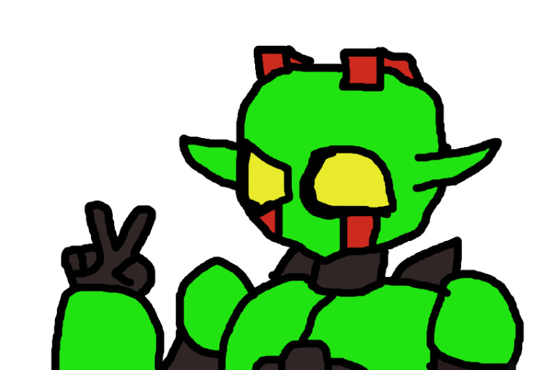
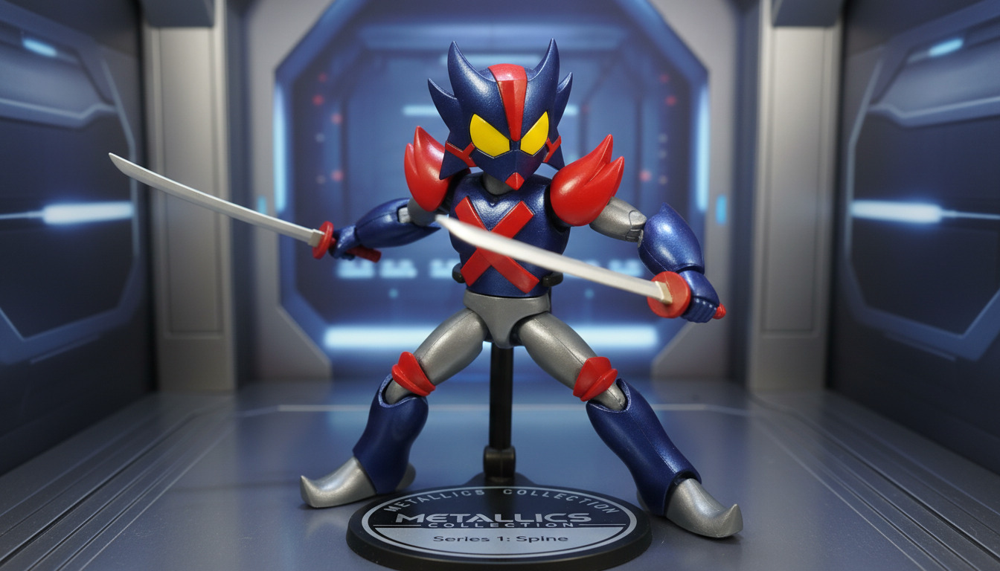

<body style="background-color: black; color: white;">
</body>
<h1 style="text-aling: center;">ELENCO</h1>
<body bgcolor="black">

Personajes

<html lang="es">
<head>
<meta chaset="UFT-8">
<meta name="viewport" content="width=device-width, initial-scale=1.0">
<body>
  

    <h1> OLIVER - GREENLIGHT</h1>
    
</body>

<strong>Lugar de nacimiento:</strong>Freewill-EstadosUnidos

  

</body>

<strong>Historia:</strong>Un chico solitario huerfano decide convertirse en heroe cuando el lugar en el que vive,Freewill City,se ve amenazada por una invasion de otro mundo.Oliver y sus amigos deciden ser heroes con traje o armaduras especiales para salvar a la ciudad,no solo por el bienestar de los ciudadanos,tambien para rellenar un vacio emocional del cual,Oliver no ha logrado llenar.Apartir de aqui,decidira el rumbo que tomara su vida con su doble identidad

    <h1> OTTO - SPINE</h1>
    
</body>

<strong>Lugar y fecha de nacimiento:</strong>21/Septiembre - Freewill-EstadosUnidos

  

</body>

<strong>Historia:</strong>Otto es un cientifico,viejo amigo de Oliver.El es alguien muy dispuesto con su trabajo,aunque a veces,dependiendo de la situacion,puede ser muy decidido o entrar en conflicto con lo que cree correcto.Se encargaria de crear los trajes para su equipo,listos para salvar al mundo.
